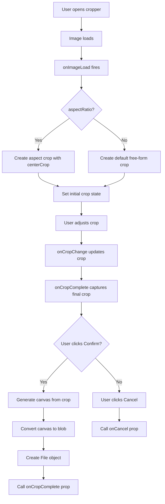

# Image Cropper Implementation Plan

## ULTRATHINK Analysis Summary

### Multi-Dimensional Analysis

#### Psychological & UX
- **User Intent**: Add functional image cropping before OCR processing
- **Current Issue**: Incomplete implementation causing confusion
- **Goal**: Clean, readable, simple implementation

#### Technical Deep Dive
**Current State:**
- ✅ `react-image-crop` v11.0.10 installed
- ✅ Responsive UI structure (Dialog/Drawer) exists
- ✅ Integration with ocr-input.tsx is correct
- ❌ Missing actual cropping logic - `CropperContent` is undefined
- ❌ No crop state management
- ❌ No canvas-based file generation

**Performance Considerations:**
- Optimize canvas operations
- Efficient image loading with `onLoad` event
- Memory leak prevention (revoke URLs, cleanup refs)

**Edge Cases:**
- Zero/negative crop dimensions
- Large images
- Mobile touch interactions
- Aspect ratio constraints

#### Accessibility
- Keyboard navigation for crop adjustments
- ARIA labels for controls
- Focus management in modals
- Screen reader announcements

#### Scalability
- Modular component structure
- Configurable aspect ratio support
- Extensible for future features
- Type-safe interfaces

---

## Architecture Design

### Component Structure

```
ImageCropper (Main Component)
├── State Management
│   ├── crop: Crop state (percentage-based)
│   ├── completedCrop: Final crop data
│   ├── imgRef: Reference to image element
│   └── [Responsive detection]
├── CropperContent (Subcomponent)
│   ├── ReactCrop component
│   ├── Image element with onLoad handler
│   └── Crop controls (Confirm/Cancel)
└── Canvas (Hidden)
    └── Used for generating cropped file
```

### Key Design Decisions

1. **Single Component with Internal State**: Simpler than splitting, easier to maintain
2. **Responsive Container**: Uses existing Shadcn UI components (Dialog/Drawer)
3. **Canvas-Based Crop Generation**: Standard cross-browser approach
4. **Percentage-Based Crop State**: Ensures responsive behavior
5. **Optional Aspect Ratio**: Flexible - passed via props or omitted for free-form

---

## Implementation Steps

### Step 1: Implement CropperContent Subcomponent
**Purpose**: Encapsulate the actual cropping UI and logic

**Requirements:**
- Import ReactCrop, centerCrop, makeAspectCrop
- Add image element with ref
- Implement onLoad handler to initialize crop
- Add ReactCrop component with proper props
- Include Confirm and Cancel buttons

**Code Structure:**
```tsx
function CropperContent() {
  const [crop, setCrop] = useState<Crop>()
  const [completedCrop, setCompletedCrop] = useState<PixelCrop>()
  const imgRef = useRef<HTMLImageElement>(null)

  const onImageLoad = (e: React.SyntheticEvent<HTMLImageElement>) => {
    // Initialize crop with optional aspect ratio
  }

  const onCropComplete = (crop: PixelCrop) => {
    setCompletedCrop(crop)
  }

  const handleConfirm = () => {
    // Generate cropped file and call onCropComplete
  }

  return (
    <div className="flex flex-col h-full">
      <div className="flex-1 overflow-auto">
        <ReactCrop
          crop={crop}
          onChange={(_, percentCrop) => setCrop(percentCrop)}
          onComplete={onCropComplete}
          aspect={aspectRatio}
        >
          
        </ReactCrop>
      </div>
      <div className="p-4 border-t flex gap-2">
        <Button variant="outline" onClick={onCancel}>Cancel</Button>
        <Button onClick={handleConfirm}>Confirm Crop</Button>
      </div>
    </div>
  )
}
```

### Step 2: Add Crop State Management
**Purpose**: Track crop state and completed crop data

**State Variables:**
- `crop`: Current crop selection (percentage-based)
- `completedCrop`: Final crop data in pixels
- `imgRef`: Reference to image element for canvas operations

**Handlers:**
- `onCropChange`: Update crop state using percentCrop
- `onCropComplete`: Capture final crop data

### Step 3: Implement Image Loading & Dimension Handling
**Purpose**: Initialize crop when image loads

**Logic:**
```tsx
const onImageLoad = (e: React.SyntheticEvent<HTMLImageElement>) => {
  const { naturalWidth: width, naturalHeight: height } = e.currentTarget

  if (aspectRatio) {
    // Use centerCrop with makeAspectCrop
    const crop = centerCrop(
      makeAspectCrop(
        { unit: '%', width: 90 },
        aspectRatio,
        width,
        height
      ),
      width,
      height
    )
    setCrop(crop)
  } else {
    // Default free-form crop
    setCrop({ unit: '%', width: 50, height: 50 })
  }
}
```

### Step 4: Add Canvas-Based Crop File Generation
**Purpose**: Convert cropped area to File object

**Logic:**
```tsx
const generateCroppedFile = useCallback(async () => {
  if (!completedCrop || !imgRef.current) return

  const image = imgRef.current
  const canvas = document.createElement('canvas')
  const ctx = canvas.getContext('2d')

  if (!ctx) return

  // Set canvas dimensions to crop size
  canvas.width = completedCrop.width
  canvas.height = completedCrop.height

  // Draw cropped area
  ctx.drawImage(
    image,
    completedCrop.x,
    completedCrop.y,
    completedCrop.width,
    completedCrop.height,
    0,
    0,
    completedCrop.width,
    completedCrop.height
  )

  // Convert to blob and create File
  const blob = await new Promise<Blob>((resolve) => {
    canvas.toBlob((blob) => resolve(blob!), 'image/jpeg', 0.9)
  })

  return new File([blob], 'cropped-image.jpg', { type: 'image/jpeg' })
}, [completedCrop])
```

### Step 5: Implement onComplete Handler
**Purpose**: Capture crop completion and update state

**Logic:**
```tsx
const onCropComplete = useCallback((crop: PixelCrop) => {
  setCompletedCrop(crop)
}, [])
```

### Step 6: Add Crop Confirmation & Cancel Actions
**Purpose**: Provide user controls to finalize or cancel crop

**Handlers:**
- `handleConfirm`: Generate cropped file and call `onCropComplete` prop
- `handleCancel`: Call `onCancel` prop

### Step 7: Add Responsive Mobile/Desktop Detection
**Purpose**: Use appropriate container based on device

**Options:**
- Use `useMediaQuery` hook from existing UI library
- Check window.innerWidth
- Use CSS media queries with matchMedia

**Recommended:** Use simple media query check
```tsx
const isMobile = useMediaQuery('(max-width: 768px)')
```

Or create a custom hook if not available:
```tsx
const useIsMobile = () => {
  const [isMobile, setIsMobile] = useState(false)

  useEffect(() => {
    const checkMobile = () => setIsMobile(window.innerWidth < 768)
    checkMobile()
    window.addEventListener('resize', checkMobile)
    return () => window.removeEventListener('resize', checkMobile)
  }, [])

  return isMobile
}
```

### Step 8: Test Integration with ocr-input Component
**Purpose**: Verify cropping works end-to-end

**Test Cases:**
1. Upload image → Click Crop → Adjust crop → Confirm → Verify cropped image
2. Capture photo → Auto-open cropper → Confirm → Verify cropped image
3. Cancel crop → Verify original image retained
4. Test with different aspect ratios

### Step 9: Verify Accessibility & Keyboard Navigation
**Purpose**: Ensure WCAG compliance

**Requirements:**
- Add `aria-label` to crop controls
- Ensure keyboard focus management
- Add descriptive alt text
- Test with screen reader

---

## Code Structure

### Final Component Interface

```tsx
export interface ImageCropperProps {
  imageUrl: string
  onCropComplete: (croppedFile: File) => void
  onCancel: () => void
  aspectRatio?: number
}
```

### Component Flow



---

## Edge Case Handling

### 1. Zero or Negative Crop Dimensions
- Validate crop dimensions before canvas generation
- Show error if crop is too small

### 2. Images Larger Than Viewport
- Use `max-w-full` and `max-h-full` CSS
- Allow scrolling in container

### 3. Mobile Touch Interactions
- ReactCrop supports touch by default
- Ensure buttons are touch-friendly (min 44px height)

### 4. Aspect Ratio Constraints
- Optional prop, defaults to free-form
- Use `makeAspectCrop` when provided

---

## Performance Optimizations

1. **Memoization**: Use `useCallback` for event handlers
2. **Debounce**: Consider debouncing crop changes if needed
3. **Canvas Cleanup**: Revoke object URLs when done
4. **Lazy Loading**: Only create canvas when confirming crop

---

## Files to Modify

- `src/components/image-cropper.tsx` - Complete implementation

---

## Success Criteria

✅ User can open cropper with image
✅ Initial crop is properly initialized
✅ User can adjust crop area
✅ Confirm generates cropped File object
✅ Cancel closes cropper without changes
✅ Works on mobile and desktop
✅ Keyboard navigation functional
✅ No memory leaks (URLs revoked, refs cleaned)
✅ Type-safe with TypeScript
✅ Uses existing Shadcn UI components

---

## Notes

- CSS import already present: `'react-image-crop/dist/ReactCrop.css?url'`
- Helper functions imported: `centerCrop`, `makeAspectCrop`
- Responsive structure (Dialog/Drawer) already implemented
- Integration with `ocr-input.tsx` is correct
