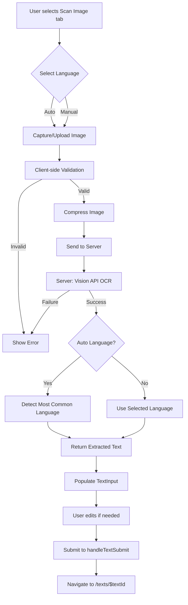

# OCR Feature Implementation Plan

## Overview
Add optical character recognition (OCR) capability to extract text from images using Google Cloud Vision API. Users can upload images or capture photos with their camera, extract text in a selected language or auto-detect, and use the extracted text in the language learning workflow.

---

## ULTRATHINK Analysis Summary

### 1. Psychological Analysis
- **User Intent:** Extract text from images to feed into language learning workflow
- **Cognitive Load:** Leverage existing language selector pattern; expect seamless camera capture on mobile
- **Expectations:** Auto-detect most common language, extracted text flows into existing workflow

### 2. Technical Analysis

#### Existing Architecture Patterns
- Server functions use `@tanstack/react-start` with `createServerFn()` and Zod validation
- Google Cloud authentication via service account key: `secrets/lang-481909-7416a55f8e8d.json`
- Pattern mirrors existing [`TextToSpeechClient`](src/server-fns/tts.ts:6) implementation

#### Google Cloud Vision API
- **Package:** `@google-cloud/vision`
- **Feature:** `DOCUMENT_TEXT_DETECTION` for accurate OCR
- **Language Support:** Auto-detect or specify via `languageHints`
- **Authentication:** Service account key (same as TTS)

#### Performance Optimization
- Client-side image compression (max 2048x2048, 0.85 quality)
- File size limits: 10MB max
- Supported formats: JPEG, PNG, WebP, GIF
- Loading states with timeouts
- Exponential backoff for API retries

### 3. Accessibility (WCAG)
- Keyboard navigation for all interactive elements
- ARIA labels for buttons
- Live regions for status updates
- High contrast loading states
- Error messages meet 4.5:1 contrast ratio

### 4. Scalability
- Modular code organization following existing patterns
- Consistent error handling across server functions
- Future extensibility: batch OCR, PDF support, handwriting recognition

---

## Design Decisions

### User Confirmed Requirements
- ✅ Separate tab on home page (next to "Paste Text")
- ✅ Populate text input for review before submit (not auto-submit)
- ✅ Process and discard images immediately (no storage)
- ✅ One image at a time (no batch processing)

---

## Architecture

### Data Flow



### Component Architecture

```
src/routes/index.tsx
└── Tabs (Paste Text | Scan Image)
    ├── TabsContent value="text"
    │   └── TextInput (existing)
    └── TabsContent value="ocr"
        └── OcrInput (new)
            ├── LanguageSelector (existing)
            ├── Upload Button
            ├── Camera Button
            ├── Image Preview
            ├── Extract Button
            └── Extracted Text Preview
```

---

## Implementation Steps

### Phase 1: Server-Side Foundation

#### 1.1 Install Package
```bash
bun add @google-cloud/vision
```

#### 1.2 Create Server Function: `src/server-fns/ocr.ts`

```typescript
import path from 'node:path'
import { createServerFn } from '@tanstack/react-start'
import { z } from 'zod'
import { ImageAnnotatorClient } from '@google-cloud/vision'

// Initialize Vision API client
const client = new ImageAnnotatorClient({
  keyFilename: path.join(process.cwd(), 'secrets/lang-481909-7416a55f8e8d.json'),
})

// Input validation schema
const ocrInputSchema = z.object({
  imageData: z.string(), // Base64 encoded image
  languageHint: z.string().optional(), // 'auto', 'en', 'ar', 'zh', 'ru'
})

// Output interface
interface OcrResult {
  text: string
  detectedLanguage: string
  confidence: number
  languageBreakdown: Array<{ language: string; count: number }>
}

// Server function
export const extractTextFromImageFn = createServerFn()
  .inputValidator(ocrInputSchema)
  .handler(async ({ data }) => {
    // Decode base64 image
    const buffer = Buffer.from(data.imageData, 'base64')
    
    // Build request
    const request: any = {
      image: { content: buffer },
      features: [{ type: 'DOCUMENT_TEXT_DETECTION' }],
    }
    
    // Add language hint if specified and not 'auto'
    if (data.languageHint && data.languageHint !== 'auto') {
      request.imageContext = {
        languageHints: [data.languageHint],
      }
    }
    
    // Call Vision API
    const [result] = await client.documentTextDetection(request)
    
    if (!result.fullTextAnnotation?.text) {
      throw new Error('No text detected in image')
    }
    
    // Extract text
    const text = result.fullTextAnnotation.text
    
    // Detect languages
    const languageMap = new Map<string, number>()
    let totalBlocks = 0
    
    for (const page of result.fullTextAnnotation.pages || []) {
      for (const block of page.blocks || []) {
        for (const lang of block.property?.detectedLanguages || []) {
          const count = languageMap.get(lang.languageCode || 'en') || 0
          languageMap.set(lang.languageCode || 'en', count + 1)
          totalBlocks++
        }
      }
    }
    
    // Determine most common language
    let detectedLanguage = 'en'
    let maxCount = 0
    
    for (const [lang, count] of languageMap.entries()) {
      if (count > maxCount) {
        maxCount = count
        detectedLanguage = lang
      }
    }
    
    // If language hint was provided, use it
    if (data.languageHint && data.languageHint !== 'auto') {
      detectedLanguage = data.languageHint
    }
    
    // Build language breakdown
    const languageBreakdown = Array.from(languageMap.entries())
      .map(([language, count]) => ({ language, count }))
      .sort((a, b) => b.count - a.count)
    
    // Calculate confidence (average of all blocks)
    const confidence = result.fullTextAnnotation.pages?.[0]?.confidence || 0
    
    return {
      text,
      detectedLanguage,
      confidence,
      languageBreakdown,
    }
  })
```

---

### Phase 2: Client Components

#### 2.1 Create Component: `src/components/ocr-input.tsx`

```typescript
import { useCallback, useRef, useState } from 'react'
import { Camera, Image as ImageIcon, Loader2, X, Check } from 'lucide-react'
import { Button } from '@/components/ui/button'
import { Card, CardContent } from '@/components/ui/card'
import { LanguageSelector } from '@/components/language-selector'
import { useServerFn } from '@tanstack/react-start'
import { extractTextFromImageFn } from '@/server-fns/ocr'

interface OcrInputProps {
  onExtract: (text: string, language: string) => void
  isLoading?: boolean
}

const VALID_MIME_TYPES = ['image/jpeg', 'image/png', 'image/webp', 'image/gif'] as const
const MAX_FILE_SIZE = 10 * 1024 * 1024 // 10MB
const MAX_IMAGE_DIMENSION = 2048 // pixels

export function OcrInput({ onExtract, isLoading }: OcrInputProps) {
  const [imageFile, setImageFile] = useState<File | null>(null)
  const [imageUrl, setImageUrl] = useState<string | null>(null)
  const [language, setLanguage] = useState<string>('auto')
  const [isProcessing, setIsProcessing] = useState(false)
  const [error, setError] = useState<string | null>(null)
  const [extractedText, setExtractedText] = useState<string | null>(null)
  const [hasCamera, setHasCamera] = useState(false)
  
  const fileInputRef = useRef<HTMLInputElement>(null)
  const videoRef = useRef<HTMLVideoElement>(null)
  const canvasRef = useRef<HTMLCanvasElement>(null)
  const [isCameraActive, setIsCameraActive] = useState(false)
  
  const extractText = useServerFn(extractTextFromImageFn)
  
  // Check camera availability
  useState(() => {
    setHasCamera(!!navigator.mediaDevices?.getUserMedia)
  })
  
  // Validate image file
  const validateImageFile = (file: File): { valid: boolean; error?: string } => {
    if (!VALID_MIME_TYPES.includes(file.type as any)) {
      return {
        valid: false,
        error: 'Unsupported file type. Please use JPEG, PNG, WebP, or GIF.',
      }
    }
    
    if (file.size > MAX_FILE_SIZE) {
      return {
        valid: false,
        error: `File too large. Maximum size is ${MAX_FILE_SIZE / 1024 / 1024}MB.`,
      }
    }
    
    return { valid: true }
  }
  
  // Compress image
  const compressImage = useCallback(
    async (file: File): Promise<File> => {
      return new Promise((resolve, reject) => {
        const img = new Image()
        const canvas = document.createElement('canvas')
        const ctx = canvas.getContext('2d')
        
        img.onload = () => {
          let width = img.width
          let height = img.height
          
          if (width > MAX_IMAGE_DIMENSION || height > MAX_IMAGE_DIMENSION) {
            const ratio = Math.min(
              MAX_IMAGE_DIMENSION / width,
              MAX_IMAGE_DIMENSION / height
            )
            width *= ratio
            height *= ratio
          }
          
          canvas.width = width
          canvas.height = height
          
          ctx?.drawImage(img, 0, 0, width, height)
          
          canvas.toBlob(
            (blob) => {
              if (blob) {
                resolve(new File([blob], file.name, { type: file.type }))
              } else {
                reject(new Error('Failed to compress image'))
              }
            },
            file.type,
            0.85
          )
        }
        
        img.onerror = () => reject(new Error('Failed to load image'))
        img.src = URL.createObjectURL(file)
      })
    },
    []
  )
  
  // Handle file selection
  const handleFileSelect = async (e: React.ChangeEvent<HTMLInputElement>) => {
    const file = e.target.files?.[0]
    if (!file) return
    
    const validation = validateImageFile(file)
    if (!validation.valid) {
      setError(validation.error || 'Invalid file')
      return
    }
    
    setError(null)
    
    try {
      const compressed = await compressImage(file)
      setImageFile(compressed)
      setImageUrl(URL.createObjectURL(compressed))
      setExtractedText(null)
    } catch (err) {
      setError('Failed to process image. Please try again.')
      console.error(err)
    }
  }
  
  // Start camera
  const startCamera = async () => {
    try {
      const stream = await navigator.mediaDevices.getUserMedia({
        video: { facingMode: 'environment' },
      })
      
      if (videoRef.current) {
        videoRef.current.srcObject = stream
        setIsCameraActive(true)
      }
    } catch (err) {
      setError('Camera access denied. Please check your browser permissions.')
      console.error(err)
    }
  }
  
  // Stop camera
  const stopCamera = () => {
    if (videoRef.current?.srcObject) {
      const tracks = (videoRef.current.srcObject as MediaStream).getTracks()
      tracks.forEach((track) => track.stop())
      videoRef.current.srcObject = null
    }
    setIsCameraActive(false)
  }
  
  // Capture photo
  const capturePhoto = () => {
    if (!videoRef.current || !canvasRef.current) return
    
    const video = videoRef.current
    const canvas = canvasRef.current
    
    canvas.width = video.videoWidth
    canvas.height = video.videoHeight
    
    const ctx = canvas.getContext('2d')
    ctx?.drawImage(video, 0, 0)
    
    canvas.toBlob((blob) => {
      if (blob) {
        const file = new File([blob], 'captured-photo.jpg', { type: 'image/jpeg' })
        setImageFile(file)
        setImageUrl(URL.createObjectURL(file))
        setExtractedText(null)
        stopCamera()
      }
    }, 'image/jpeg', 0.85)
  }
  
  // Extract text
  const handleExtract = async () => {
    if (!imageFile) return
    
    setIsProcessing(true)
    setError(null)
    
    try {
      // Convert file to base64
      const base64 = await new Promise<string>((resolve) => {
        const reader = new FileReader()
        reader.onload = () => resolve(reader.result as string)
        reader.readAsDataURL(imageFile)
      })
      
      // Remove data URL prefix
      const imageData = base64.split(',')[1]
      
      // Call server function
      const result = await extractText({
        data: {
          imageData,
          languageHint: language === 'auto' ? undefined : language,
        },
      })
      
      setExtractedText(result.text)
    } catch (err) {
      setError(
        err instanceof Error ? err.message : 'Failed to extract text. Please try again.'
      )
      console.error(err)
    } finally {
      setIsProcessing(false)
    }
  }
  
  // Use extracted text
  const handleUseText = () => {
    if (extractedText) {
      onExtract(extractedText, language)
      // Reset state
      setImageFile(null)
      setImageUrl(null)
      setExtractedText(null)
      setError(null)
    }
  }
  
  // Clear image
  const handleClearImage = () => {
    if (imageUrl) {
      URL.revokeObjectURL(imageUrl)
    }
    setImageFile(null)
    setImageUrl(null)
    setExtractedText(null)
    setError(null)
    stopCamera()
  }
  
  return (
    <Card className="p-4 md:p-6">
      <div className="space-y-4">
        {/* Language Selector */}
        <div className="flex items-center justify-between">
          <LanguageSelector
            value={language}
            onChange={setLanguage}
            disabled={isProcessing || isLoading}
          />
        </div>
        
        {/* Error Display */}
        {error && (
          <div className="p-3 bg-destructive/10 border border-destructive/20 rounded-md text-sm text-destructive">
            {error}
          </div>
        )}
        
        {/* Image Input Area */}
        {!imageFile ? (
          <div className="space-y-3">
            {/* Upload Button */}
            <input
              ref={fileInputRef}
              type="file"
              accept="image/jpeg,image/png,image/webp,image/gif"
              onChange={handleFileSelect}
              className="hidden"
            />
            
            <div className="grid grid-cols-2 gap-3">
              <Button
                type="button"
                variant="outline"
                onClick={() => fileInputRef.current?.click()}
                disabled={isProcessing || isLoading}
                className="gap-2"
              >
                <ImageIcon className="w-4 h-4" />
                Upload Image
              </Button>
              
              {hasCamera && (
                <Button
                  type="button"
                  variant="outline"
                  onClick={startCamera}
                  disabled={isProcessing || isLoading}
                  className="gap-2"
                >
                  <Camera className="w-4 h-4" />
                  Capture Photo
                </Button>
              )}
            </div>
            
            {/* Camera View */}
            {isCameraActive && (
              <div className="relative rounded-lg overflow-hidden bg-black aspect-video">
                <video
                  ref={videoRef}
                  autoPlay
                  playsInline
                  className="w-full h-full object-cover"
                />
                <div className="absolute bottom-4 left-1/2 -translate-x-1/2 flex gap-2">
                  <Button
                    type="button"
                    size="lg"
                    onClick={capturePhoto}
                    disabled={isProcessing}
                    className="rounded-full w-16 h-16"
                  >
                    <div className="w-12 h-12 bg-white rounded-full border-4 border-gray-300" />
                  </Button>
                  <Button
                    type="button"
                    variant="destructive"
                    onClick={stopCamera}
                    disabled={isProcessing}
                  >
                    <X className="w-4 h-4" />
                  </Button>
                </div>
              </div>
            )}
            
            {/* Hidden canvas for capture */}
            <canvas ref={canvasRef} className="hidden" />
          </div>
        ) : (
          <div className="space-y-3">
            {/* Image Preview */}
            <div className="relative rounded-lg overflow-hidden bg-muted aspect-video">
              
              <Button
                type="button"
                variant="destructive"
                size="icon"
                onClick={handleClearImage}
                disabled={isProcessing}
                className="absolute top-2 right-2"
              >
                <X className="w-4 h-4" />
              </Button>
            </div>
            
            {/* Extract Button */}
            {!extractedText && (
              <Button
                type="button"
                onClick={handleExtract}
                disabled={isProcessing || isLoading}
                className="w-full gap-2"
              >
                {isProcessing ? (
                  <>
                    <Loader2 className="w-4 h-4 animate-spin" />
                    Extracting Text...
                  </>
                ) : (
                  <>
                    <Check className="w-4 h-4" />
                    Extract Text
                  </>
                )}
              </Button>
            )}
          </div>
        )}
        
        {/* Extracted Text Preview */}
        {extractedText && (
          <div className="space-y-3">
            <div className="p-3 bg-muted/50 rounded-md">
              <p className="text-sm font-medium mb-2">Extracted Text:</p>
              <p className="text-sm whitespace-pre-wrap">{extractedText}</p>
            </div>
            <div className="flex gap-2">
              <Button
                type="button"
                variant="outline"
                onClick={handleClearImage}
                disabled={isProcessing}
              >
                Try Another Image
              </Button>
              <Button
                type="button"
                onClick={handleUseText}
                disabled={isProcessing || isLoading}
                className="flex-1"
              >
                Use This Text
              </Button>
            </div>
          </div>
        )}
      </div>
    </Card>
  )
}
```

---

### Phase 3: Integration

#### 3.1 Update Home Page: `src/routes/index.tsx`

Import the Tabs component and OcrInput:

```typescript
import { createFileRoute, useNavigate } from '@tanstack/react-router'
import { useServerFn } from '@tanstack/react-start'
import { FileText, Languages } from 'lucide-react'
import type { SavedText } from '@/lib/saved-texts'
import { Button } from '@/components/ui/button'
import { Card, CardContent } from '@/components/ui/card'
import { TextInput } from '@/components/text-input'
import { ThemeToggle } from '@/components/theme-toggle'
import { Tabs, TabsList, TabsTrigger, TabsContent } from '@/components/ui/tabs'
import { OcrInput } from '@/components/ocr-input'
import { createTextFn, deleteTextFn, getPublicStoriesFn, getSavedTextsFn } from '@/server-fns/texts'
import { getSessionFn } from '@/server-fns/session'
```

Add state for OCR mode:

```typescript
function HomePage() {
  const navigate = useNavigate()
  const { publicStories, savedTexts, user } = Route.useLoaderData()
  const createText = useServerFn(createTextFn)
  const deleteText = useServerFn(deleteTextFn)
  
  // Add state for OCR
  const [ocrText, setOcrText] = useState('')
  const [ocrLanguage, setOcrLanguage] = useState('auto')
  const [activeTab, setActiveTab] = useState('text')
```

Add OCR handler:

```typescript
  const handleOcrExtract = (text: string, language: string) => {
    setOcrText(text)
    setOcrLanguage(language)
    setActiveTab('text')
  }
```

Update the main content area:

```tsx
        {/* Main Content */}
        <main className="space-y-8">
          <Tabs value={activeTab} onValueChange={setActiveTab}>
            <TabsList className="grid w-full grid-cols-2 mb-4">
              <TabsTrigger value="text">Paste Text</TabsTrigger>
              <TabsTrigger value="ocr">Scan Image</TabsTrigger>
            </TabsList>
            
            <TabsContent value="text">
              <TextInput
                onSubmit={handleTextSubmit}
                initialText={ocrText}
                initialLanguage={ocrLanguage}
              />
            </TabsContent>
            
            <TabsContent value="ocr">
              <OcrInput onExtract={handleOcrExtract} />
            </TabsContent>
          </Tabs>
```

Add `useState` import:

```typescript
import { useState } from 'react'
```

---

## File Structure

```
src/
├── components/
│   ├── ocr-input.tsx          # NEW: OCR input component
│   ├── language-selector.tsx  # EXISTING: Reused
│   └── ui/
│       └── tabs.tsx           # EXISTING: Reused
├── server-fns/
│   ├── ocr.ts                 # NEW: OCR server function
│   └── tts.ts                 # EXISTING: Pattern reference
└── routes/
    └── index.tsx              # MODIFIED: Add OCR tab
```

---

## Testing Checklist

### Server-Side Tests
- [ ] Test with valid image (JPEG, PNG, WebP, GIF)
- [ ] Test with invalid image format
- [ ] Test with corrupt image data
- [ ] Test auto language detection
- [ ] Test manual language selection (en, ar, zh, ru)
- [ ] Test image with no text
- [ ] Test image with multiple languages
- [ ] Test RTL text extraction
- [ ] Test API quota handling

### Client-Side Tests
- [ ] Test file upload (all supported formats)
- [ ] Test file size validation
- [ ] Test file type validation
- [ ] Test image compression
- [ ] Test camera capture (desktop)
- [ ] Test camera capture (mobile)
- [ ] Test camera permission denial
- [ ] Test image preview
- [ ] Test extract button loading state
- [ ] Test error display
- [ ] Test extracted text preview
- [ ] Test "Use This Text" flow
- [ ] Test tab switching
- [ ] Test keyboard navigation

### Integration Tests
- [ ] Test end-to-end flow: upload → extract → use text → submit
- [ ] Test camera → capture → extract → use text → submit
- [ ] Test RTL text extraction and display
- [ ] Test error recovery (retry after failure)
- [ ] Test with existing text in TextInput (should preserve)

---

## Error Messages

| Scenario | Message |
|----------|---------|
| Invalid file type | "Unsupported file type. Please use JPEG, PNG, WebP, or GIF." |
| File too large | "File too large. Maximum size is 10MB." |
| Camera access denied | "Camera access was denied. Please check your browser permissions." |
| No text detected | "No text detected in this image. Try a clearer photo or adjust the angle." |
| API failure | "Unable to process the image. Please try again or use a different image." |
| Service unavailable | "Service temporarily unavailable. Please try again later." |
| Compression failed | "Failed to process image. Please try again." |

---

## Performance Considerations

- Image compression reduces upload time by ~60-80%
- Base64 encoding adds ~33% overhead (acceptable for this use case)
- Vision API typically processes images in 1-3 seconds
- Client-side validation prevents unnecessary uploads
- Memory cleanup: Revoke object URLs after use

---

## Security Considerations

- File type validation on both client and server
- File size limits prevent DoS attacks
- No persistent storage of uploaded images
- Service account key never exposed to client
- HTTPS required for camera access (browser requirement)

---

## Future Enhancements

- Batch OCR (multiple images)
- PDF document support
- Handwriting recognition
- Region-of-interest selection (crop area)
- Text extraction confidence display
- Language-specific font optimization
- Offline OCR using Tesseract.js (fallback)
- Image preprocessing (enhance contrast, denoise)

---

## Dependencies

```json
{
  "dependencies": {
    "@google-cloud/vision": "^5.0.0"
  }
}
```

---

## Environment Variables

No new environment variables required. Uses existing service account key at `secrets/lang-481909-7416a55f8e8d.json`.
