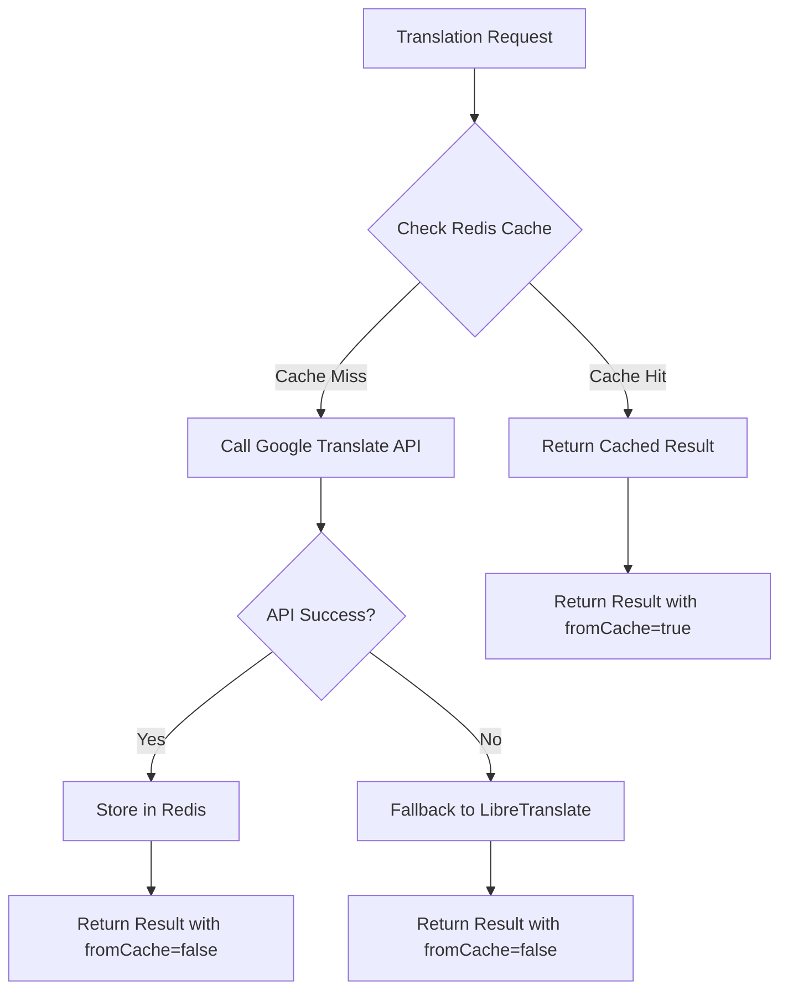

# Redis Caching Implementation Plan

## Overview
Implement Redis caching for Google Translate translations to reduce API calls and improve performance. Cache should only apply to Google Translate results, not LibreTranslate fallbacks.

## Architecture



## Key Requirements

1. **Cache Scope**: Only cache Google Translate translations
2. **Cache Key**: Based on word + source language + target language
3. **Cache Expiration**: Configurable TTL (default: 7 days)
4. **UI Indicator**: Show visual indication when translation comes from cache
5. **Fallback Behavior**: Do not cache LibreTranslate results

## Implementation Steps

### 1. Create Redis Client Module
**File**: `src/lib/redis.ts`
- Use Bun's built-in Redis client (`import { redis } from "bun"`)
- Configure connection using `REDIS_URL` environment variable (automatically read by Bun)
- Export singleton Redis client instance
- Handle connection errors gracefully
- Add health check method
- No additional package installation needed (Bun has native Redis support)

### 3. Update Translation Interface
**File**: `src/lib/translate.ts`
- Add `fromCache?: boolean` to `TranslateResult` interface
- This flag will indicate if the translation came from Redis cache

### 4. Implement Caching Logic
**File**: `src/lib/translate.ts`

**Cache Key Format**: `translation:${sourceLanguage}:${targetLanguage}:${textHash}`

**Logic Flow**:
1. Generate cache key from text and language parameters
2. Check Redis for existing cached translation
3. If cache hit:
   - Return cached result with `fromCache: true`
   - Skip Google API call
4. If cache miss:
   - Call Google Translate API
   - If successful, store result in Redis with TTL
   - Return result with `fromCache: false`
5. If Google API fails:
   - Fallback to LibreTranslate (no caching)
   - Return result with `fromCache: false`

### 5. Update Server Function
**File**: `src/server-fns/translate.ts`
- Include `fromCache` in the response object
- Preserve cache status through the entire translation flow

### 6. Update UI Components
**File**: `src/components/translation-popup.tsx`

**Visual Indicator**:
- Add a badge/icon when `fromCache` is true
- Use a subtle visual cue (e.g., a database icon or "Cached" badge)
- Position near the translation result
- Style should be distinct from the LibreTranslate warning

**Design Options**:
1. Small badge with "Cached" text
2. Database icon with tooltip explaining cache
3. Subtle background color change

### 7. Cache Configuration
**Environment Variables**:
- `REDIS_URL`: Redis connection string (already exists)
- `TRANSLATION_CACHE_TTL`: Cache expiration time in seconds (optional, default: 604800 = 7 days)

## Data Structure

### Cache Entry Format
```typescript
{
  translatedText: string;
  detectedLanguage?: string;
  timestamp: number;
}
```

### Cache Key Examples
- `translation:auto:es:7a8b9c1d` (auto-detect to Spanish)
- `translation:en:fr:3e4f5a6b` (English to French)

## Error Handling

1. **Redis Unavailable**: Fall back to direct API calls, log warning
2. **Cache Read Errors**: Treat as cache miss, proceed with API call
3. **Cache Write Errors**: Return translation result, log warning (non-blocking)

## Performance Considerations

1. **Connection Pooling**: ioredis handles this automatically
2. **Pipeline Operations**: Not needed for single-word translations
3. **Memory Usage**: Monitor Redis memory usage with translations
4. **TTL Strategy**: 7 days provides good balance between freshness and cache hit rate

## Testing Strategy

1. **Unit Tests**: Test cache key generation, hit/miss logic
2. **Integration Tests**: Test full flow with real Redis instance
3. **UI Tests**: Verify cache indicator displays correctly
4. **Performance Tests**: Measure improvement in translation response time

## Future Enhancements

1. **Cache Statistics**: Track hit/miss ratio for monitoring
2. **Cache Invalidation**: Manual cache invalidation endpoint
3. **Warm-up Cache**: Pre-populate cache with common translations
4. **Distributed Cache**: Support for Redis Cluster if needed

## Dependencies

- **None** - Bun's built-in Redis client is used
- No additional packages to install
- Uses existing infrastructure

## Notes

- Cache only applies to Google Translate API calls
- LibreTranslate fallback results are never cached
- Cache is transparent to the user except for the UI indicator
- Redis connection failures should not break translation functionality
